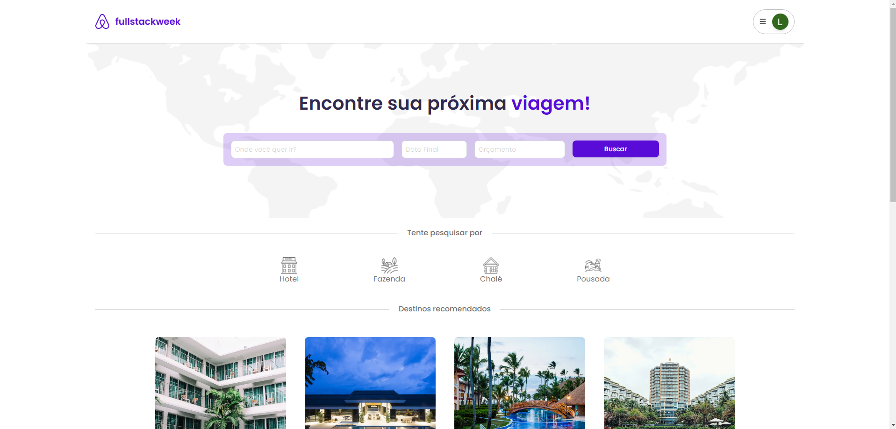
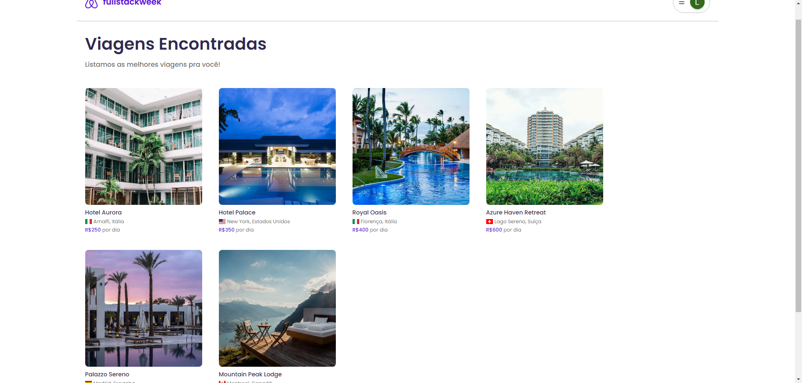
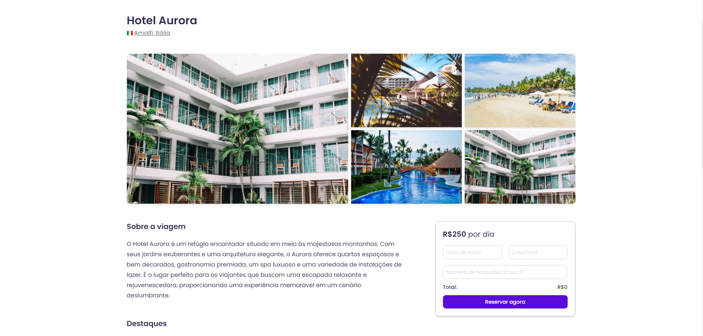
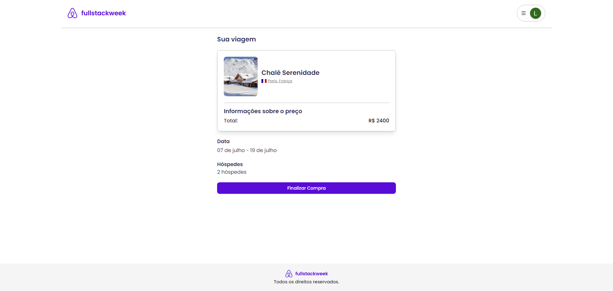
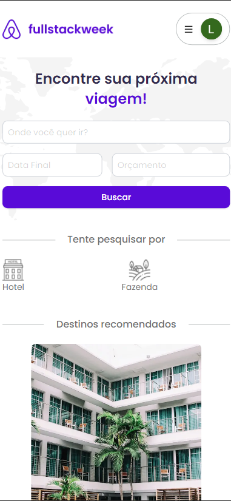
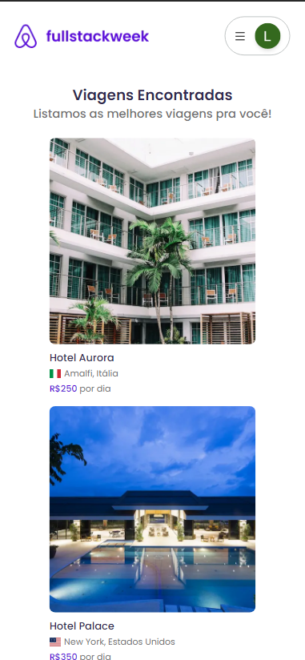
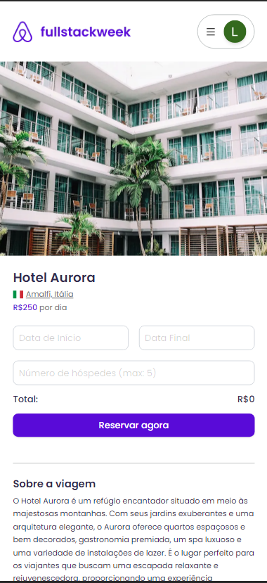
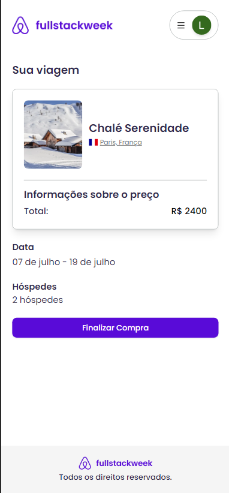
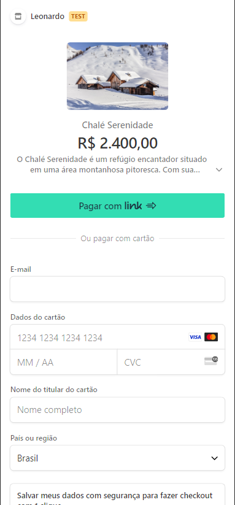

# Sistema de Reservas

## Sobre o projeto

Este projeto é um sistema de reservas, onde o usuário pode agendar um hotel, fazenda, chalé e pousada para sua próxima viagem.
Após escolher o local, o usuário pode ver fotos, destaques, descrição do lugar e realizar a sua reserva!
É possível também realizar uma busca para uma viagem específica.
O site contém um sistema de login realizado com o next-auth e sistema de pagamentos com o Stripe.

## Layout 

## Layout Mobile

## Tecnologias utilizadas 

- Next.js, React
- Tailwind
- Prisma, supabase
- Stripe
